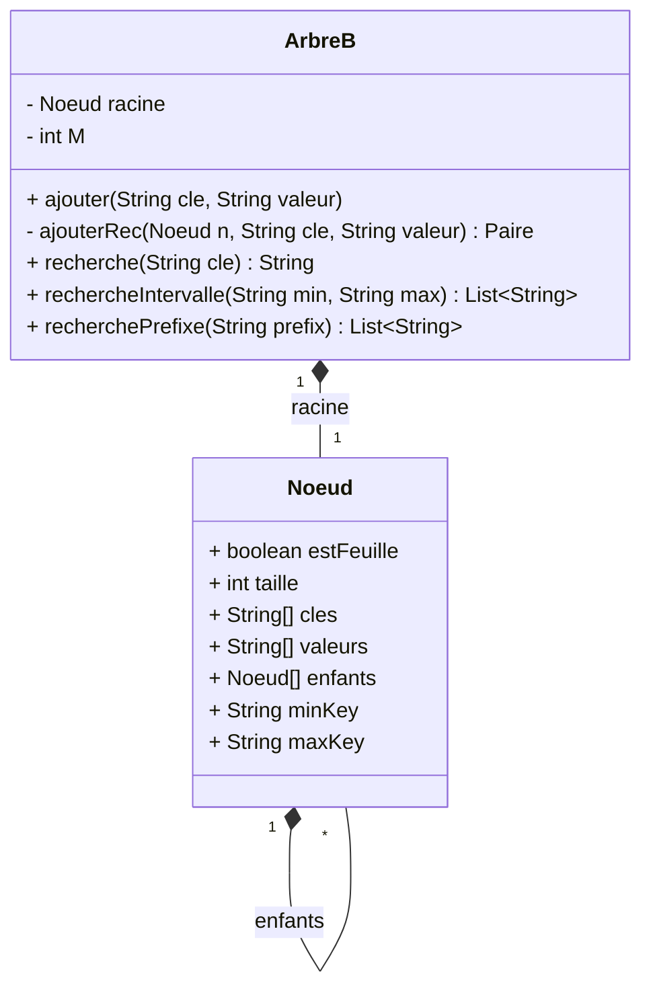

# 🌳 B-Tree Implementation in Java

This project is part of the **Advanced Databases (Base de données avancée)** course.  
It provides an **educational implementation of a B-Tree** in Java, focusing on the principles of balanced search trees and their role in database indexing.

---

## 📌 Features

- Implementation of a **B-Tree** with configurable maximum number of keys (`M ≥ 2`).
- Supports:
  - **Insertion** of key–value pairs (`ajouter`, `ajouterRec`)
  - **Lookup** of values by key (`recherche`)
  - **Automatic node splitting** (`splitFeuille`, `splitInterne`)
  - **Interval search** (values between two keys)
  - **Prefix search** (all keys starting with a given prefix)
- Includes **tests**:
  - `testSimple` → step-by-step demonstration
  - `testCommunes` → large dataset (French communes)

---

## 📐 UML Overview

