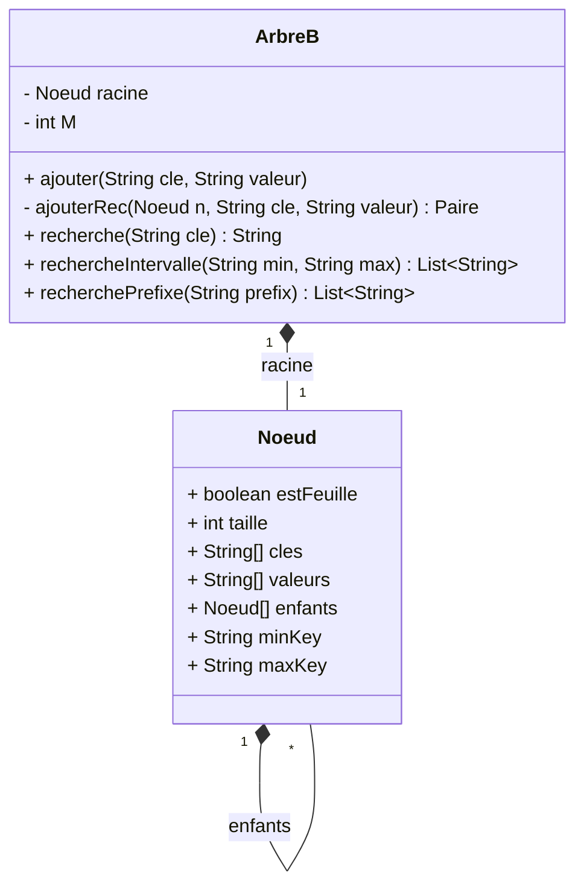

# 🌳 B-Tree Implementation in Java

This project is part of the **Advanced Databases (Base de données avancée)** course.  
It provides an **educational implementation of a B-Tree** in Java, focusing on the principles of balanced search trees and their role in database indexing.

---

## 📌 Features

- Implementation of a **B-Tree** with configurable maximum number of keys (`M ≥ 2`).
- Supports:
  - **Insertion** of key–value pairs (`ajouter`, `ajouterRec`)
  - **Lookup** of values by key (`recherche`)
  - **Automatic node splitting** (`splitFeuille`, `splitInterne`)
  - **Interval search** (values between two keys)
  - **Prefix search** (all keys starting with a given prefix)
- Includes **tests**:
  - `testSimple` → step-by-step demonstration
  - `testCommunes` → large dataset (French communes)

---

## 📐 UML Overview



---

## 🛠️ Classes and Methods

### **`ArbreB`**

Represents the **B-Tree**.

- `ajouter(cle, valeur)` → Inserts a key–value pair into the tree.
- `ajouterRec(Noeud n, cle, valeur)` → Recursive helper with split handling.
- `recherche(cle)` → Returns the value associated with a key.
- `rechercheIntervalle(min, max)` → Returns values with keys in `[min, max]`.
- `recherchePrefixe(prefix)` → Returns values for keys starting with a prefix.
- `splitFeuille(Noeud n, cle, valeur)` → Splits a full leaf node.
- `splitInterne(Noeud n)` → Splits a full internal node.

### **`Noeud`**

Represents both **internal nodes** and **leaf nodes**.

- Attributes:
  - `estFeuille` → true if the node is a leaf.
  - `cles[]` → keys stored in the node.
  - `valeurs[]` → values (for leaves).
  - `enfants[]` → child pointers (for internal nodes).
  - `taille` → number of keys stored.
  - `minKey`, `maxKey` → boundaries of the subtree (for pruning).

---

## 🚀 Usage

Compile and run:

```bash
javac ArbreB.java
java ArbreB
```

### Example

```java
ArbreB btree = new ArbreB();
btree.ajouter("5", "val5");
btree.ajouter("10", "val10");
btree.ajouter("20", "val20");
btree.ajouter("7", "val7"); // triggers split

System.out.println(btree.recherche("10")); // → val10
System.out.println(btree.rechercheIntervalle("5", "15")); // → [val5, val7, val10]
```

---

## 📚 Educational Context

This project illustrates:

- How **B-Trees** maintain balance and efficiency.
- How **splits** are propagated during insertion.
- How databases implement **index structures** (B-Tree, B+Tree) for efficient lookups.
- Extensions such as **interval search** and **prefix search**, as discussed in the TP instructions.

---
