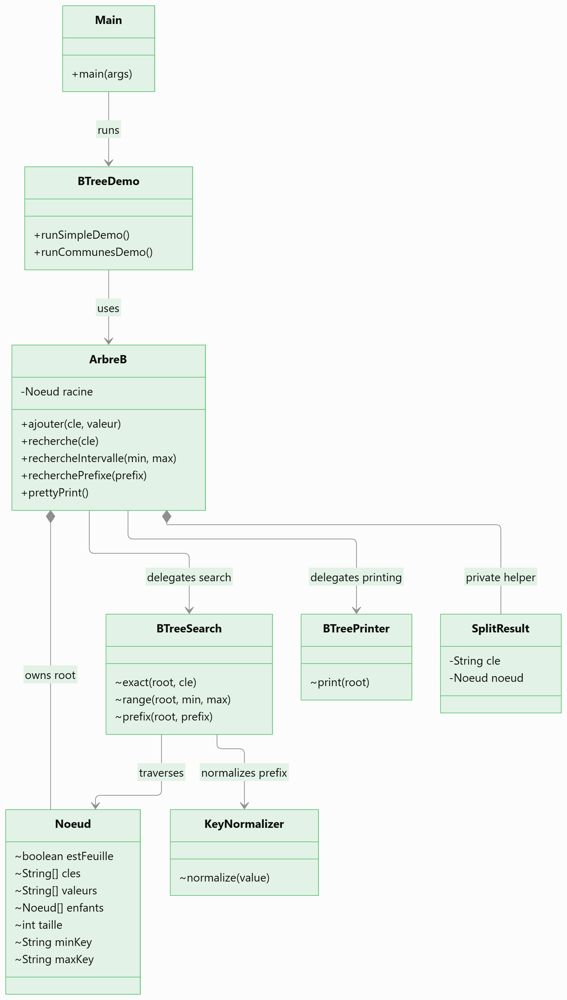
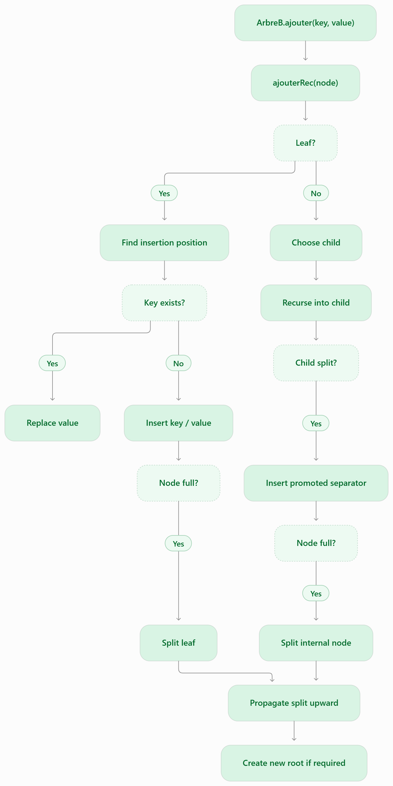
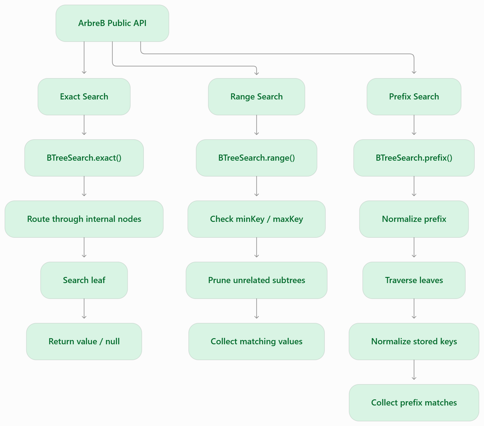

# Architecture

This document describes the **current architecture** of the in-memory B-Tree implementation.

The goal of the refactoring is to keep the public API small while separating tree coordination, node behavior, search logic, normalization, visualization, and demo code.

## Project Structure

```text
src/
├── main/
│   └── java/
│       ├── app/
│       │   ├── Main.java
│       │   └── BTreeDemo.java
│       └── arbreb/
│           ├── ArbreB.java
│           ├── Noeud.java
│           ├── BTreeSearch.java
│           ├── BTreePrinter.java
│           └── KeyNormalizer.java
└── test/
    └── java/
        └── arbreb/
            ├── ArbreBInsertionTest.java
            ├── ArbreBRegressionTest.java
            └── ArbreBSearchTest.java
```

## Component Responsibilities

### `ArbreB`

`ArbreB` is the main public entry point of the index.

Responsibilities:

- owns the root node
- coordinates insertion
- propagates node splits
- handles root replacement after a split
- exposes the public search API
- delegates search and visualization work to focused components

`SplitResult` remains a private helper inside `ArbreB` because it is only used while propagating splits during insertion.

### `Noeud`

`Noeud` represents both leaf and internal nodes.

Responsibilities:

- stores keys
- stores values in leaf nodes
- stores child references in internal nodes
- tracks node size
- routes a key to the correct child
- finds leaf insertion positions
- performs local key/child shifting and insertion
- maintains `minKey` / `maxKey` subtree metadata

Keeping these operations close to the node reduces low-level array manipulation inside `ArbreB`.

### `BTreeSearch`

`BTreeSearch` contains read-only traversal logic.

Supported operations:

- exact search
- range search
- prefix search

Exact search follows separator routing through internal nodes.

Range search uses `minKey` / `maxKey` metadata to prune subtrees that cannot contain matching keys.

Prefix search normalizes keys before comparison and currently avoids range pruning because normalized ordering may differ from the original tree ordering.

### `KeyNormalizer`

`KeyNormalizer` centralizes prefix-search normalization.

It converts strings to lowercase and removes accents before prefix comparison while preserving the original keys stored in the tree.

### `BTreePrinter`

`BTreePrinter` provides a terminal-safe ASCII representation of the tree.

It is intentionally separate from the indexing algorithm so visualization does not become part of insertion or search logic.

### `BTreeDemo`

`BTreeDemo` demonstrates the public API without accessing internal tree structures.

It provides:

- a small insertion/split demo
- a real dataset demo using `data/communes.txt`
- exact-search examples
- prefix-search examples

The demo layer is separate from the JUnit test suite.

### `Main`

`Main` is the application entry point.

It selects the requested demo and delegates execution to `BTreeDemo`.

## Dependency Overview



The important boundary is that application code talks to `ArbreB`; internal node representation remains inside the `arbreb` package.

## Insertion Flow



When the root splits, `ArbreB` creates a new root and attaches the previous root and the new right node as children.

## Search Flow



This keeps traversal logic out of the insertion coordinator while preserving a small public API.
## Testing Boundary

The automated test suite is separated by behavior:

```text
ArbreBInsertionTest
├── insertion
├── leaf split
├── internal split
└── insertion order

ArbreBSearchTest
├── exact search
├── range search
└── prefix search

ArbreBRegressionTest
├── duplicate-key replacement
└── stale range-metadata regression
```

The project follows regression-first refactoring: behavior is protected by tests before internal responsibilities are moved.

## Current Design Constraints

The current architecture intentionally remains small.

- storage is in memory
- keys and values are `String`
- node capacity is currently controlled by `ArbreB.M`
- child references are direct Java object references
- prefix search does not use normalized-order pruning
- persistence and page-based storage are not implemented yet

These are tracked as future milestones rather than presented as completed features.

## Architectural Direction

The current refactoring establishes a clean in-memory foundation before adding larger storage-engine concepts.


The design priority is:

**Correctness | Separation of concerns | Measurable performance | Persistence**
